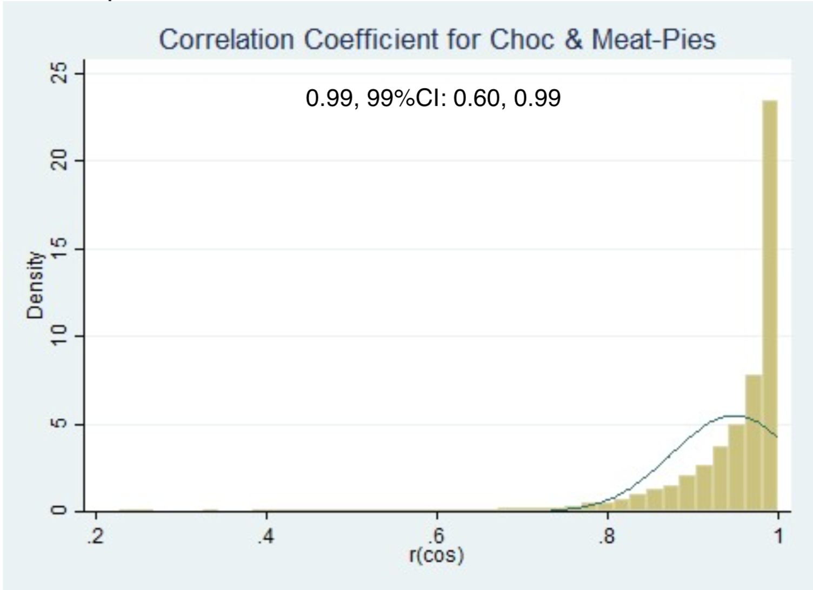

class: middle

# Outline of today's talk 

--
### Correspondence analyses:


- Relationship between **food consumed** and **eating location** for UK adolescents


- Relationship between **food consumed** and **eating time** for UK adults according to their diabetes status 

--

### Multilevel Latent Class Analysis:

- Relationship between **carbohydrate consumption** and **eating time** for UK adults. 

---
class: middle

## Some intuition about correspondence analysis  (CA)

- CA is a method for investigating the relationship in a **two-dimensional contingency table**.

- It takes a large table, and turns it into a seemingly easy-to-read visualization.


---
class: middle

## Analysis of a contingency table

- The frequency of consumption of three healthy food groups at each location in the NDNS RP data among teenagers (age: 11~19 years):

```{r eval = T, echo=FALSE, message=FALSE}
library(knitr)
library(kableExtra)
library(tidyverse)
load("../CA-NDNSRP/H_teenFood.Rdata")

TableFoogGroup <- H_teenFood %>% 
  ungroup() %>% 
  group_by(mfgLab) %>% 
  summarise(n = n(), meanHpoint = mean(H_points, na.rm = T), mfgCalories = sum(Energykcal)) %>% 
  arrange(-mfgCalories) %>% 
  mutate(n.freq = paste0(round(100 * n/sum(n), 2), "%"))  %>% 
  mutate(cal.Prop = paste0(round(100 * mfgCalories/sum(mfgCalories), 2), "%"))  %>% 
  mutate(calprop = mfgCalories/sum(mfgCalories)) %>% 
  mutate(calcumprop = paste0(round(100 * cumsum(calprop), 3), "%")) %>% 
  select(-calprop) 


TableFoogGroup <- TableFoogGroup %>% 
  mutate(healthy     = meanHpoint < -2, 
         lesshealthy = meanHpoint > 4, 
         neutral     = (meanHpoint <= 4) & (meanHpoint >= -2))

# TableFoogGroup %>% 
#   filter(healthy) %>% 
#   select(-lesshealthy, -neutral, -calcumprop, -healthy)
healthyfg <- H_teenFood %>% 
  filter(mfgLab %in% c("Fruit", "Veg not raw", "Brown Bread"))
freqtab <- xtabs(~healthyfg$mfgLab + healthyfg$Locat_type)
freqtabmg <- addmargins(freqtab)
as.data.frame.matrix(freqtabmg) %>%
  kable() %>%
  kable_styling(bootstrap_options = c("striped", "hover")) %>% 
  column_spec(1, bold = T) 
```


---
class: middle 

## Usually, we will conduct a $\chi^2$ test. 

```{r eval = T, echo=FALSE, message=FALSE}
as.data.frame.matrix(freqtabmg) %>%
  kable() %>%
  kable_styling(bootstrap_options = c("striped", "hover")) %>% 
  column_spec(1, bold = T) 
```


$$
\chi^2 = \sum\frac{(\text{Observed} - \text{Expected})^2}{\text{Expected}} \sim \chi^2_{(m -1)\times(n-1)}
$$

--
To look for evidence against the null hypothesis that **there is no difference across the columns or rows**.

---
class: middle
## Hypothesis of independence

The null hypothesis of no difference across the columns or rows is also called: **Hypothesis of independence, or Homogeneity assumption.**

```{r}
chisq.test(freqtab)
```


We conclude that **there is dependency between the columns (food groups) and the rows (locations)**. 

---
class: middle

## But what exactly does this dependency mean?


```{r eval = T, echo=FALSE, message=FALSE}
as.data.frame.matrix(freqtabmg) %>%
  kable() %>%
  kable_styling(bootstrap_options = c("striped", "hover"))%>% 
  column_spec(1, bold = T) 
```

### Can we get **more information** from this contingency table? How?

--
### Yes! we can visualize their relationships!


---
class: middle 

### Step 1 - convert the frequency cell to proportions

```{r echo = FALSE}
Xp <- as.matrix(freqtab) / sum(as.matrix(freqtab))
Xpmg <- addmargins(Xp)
Xpmg <- signif(Xpmg, digits = 3)

Xp_4 <- sprintf("%.4f", Xpmg)
Xp_4 <- matrix(Xp_4, nrow = 4)
row.names(Xp_4) <- c("Brown Bread", "Fruit", "Veg not raw", "c: col masses")
colnames(Xp_4) <- c("Others", "Home", "School_work", "r: row masses")

as.data.frame.matrix(Xp_4) %>%
  kable(caption = "Matrix X. Observed Cell Proportions") %>%
  kable_styling(bootstrap_options = c("striped", "hover")) %>% 
  column_spec(1, bold = T) 
```

???
- Row masses: $\mathbf{r} = \mathbf{X1}$ 

```{r}
r <- Xp %*% matrix(c(1, 1, 1), nrow = 3)
```

- Column masses: $\mathbf{c} = \mathbf{X}^T\mathbf{1}$

```{r}
c <- t(Xp)  %*% matrix(c(1, 1, 1), nrow = 3)
```


- On average (77.8%) most of the healthy foods are eaten at home

---
class: middle 
### Step 2 - The deviation (residuals) of each cell in matrix X from its expected value

$$\text{Deviation} = \mathbf{X} - \mathbf{rc}^T$$

```{r echo=FALSE}
Deviation <- Xp - r %*% t(c)
library(formattable)
Deviation <- addmargins(Deviation)
Dev <- sprintf("%.5f", Deviation)
Dev <- matrix(Dev, nrow = 4)
rownames(Dev) <- rownames(Deviation)
colnames(Dev) <- colnames(Deviation)
as.data.frame.matrix(Dev) %>%
  kable(caption = "Deviations from Expected") %>%
  kable_styling(bootstrap_options = c("striped", "hover")) %>% 
  column_spec(1, bold = T) 
```

???
Big positive (negative) numbers means a strong positive (negative) relationship.


The residuals quantify the difference between the observed data and the data we would expect under the assumption that there is no relationship between the row and column categories of the table.

---
class: middle

### Step 3 - Standardise the residual for fair comparison (Z score)

$$
\mathbf{Z}  = \mathbf{D}_r^{-\frac{1}{2}} \times \text{Deviation} \times \mathbf{D}_c^{-\frac{1}{2}}
$$


```{r eval=TRUE, echo=FALSE}
Deviation <- Xp - r %*% t(c)
Dr <- diag(as.numeric(r))
Dc <- diag(as.numeric(c))
z <- solve(expm::sqrtm((Dr))) %*% Deviation %*% solve(expm::sqrtm((Dc)))

Z_name <- sprintf("%.5f", z)
Z_name <- matrix(Z_name, nrow = 3)
rownames(Z_name) <- c("Brown Bread", "Fruit", "Veg not raw")
colnames(Z_name) <- c("Others", "Home", "School_work")
as.data.frame.matrix(Z_name) %>%
  kable(caption = "Standardised Residuals Table") %>%
  kable_styling(bootstrap_options = c("striped", "hover")) %>% 
  column_spec(1, bold = T) 
```


???
These standardized residuals are z-scores.  This means that values of more than 1.96, or less than -1.96, are significant at the 0.05 level. For binary variables, their standard deviation is the square root of their expected values. 


---
class: middle

### Step 4 - Single Value Decomposition

$$
\mathbf{Z} = \mathbf{UD}_\lambda \mathbf{V}^T
$$

Where, 

- $\mathbf{Z}$: the standardised deviation matrix; 
- $\mathbf{U}$: the left singular vectors of $\mathbf{Z}$ <br> (principal axes of food groups space **for projection of locations**); 
- $\mathbf{D}_\lambda$: singular values matrix;
- $\mathbf{V}^T$: right singular vectors of $\mathbf{Z}$<br> (principal axes of location space **for projection of food groups**).

---
class: middle

### Recall that in principle component analysis (PCA)  - Spectral decomposition

$$
\mathbf{S} = \mathbf{P}\Lambda\mathbf{P}^T
$$

### It is also easy to prove that 

$$
\mathbf{D}_\lambda^2 = \Lambda
$$

???

- S is the variance covariance matrhx 
- Lambda is the diagonal eigenvalue matrix 
- P is orthogonal projection matrix with new coordinates for the rotated new variables

---
class: middle
### Step 4 - Single Value Decomposition

.small[
$$
\begin{aligned}
\mathbf{Z}  & = \mathbf{UD}_\lambda \mathbf{V}^T \\ 
\mathbf{Z}  & = \left[\begin{matrix}
0.00039&-0.032&0.083\\
0.02285&-0.071&0.162\\
-0.01694&0.064&-0.148
\end{matrix}\right] \\
= \left[\begin{matrix}
-0.34&0.8980&0.28\\
-0.69&-0.4400&0.57\\
0.63&0.0043&0.77
\end{matrix}\right]& 
\left(\begin{matrix}
0.26&0&0\\
0&0.01&0\\
0&0&0
\end{matrix}\right) 
\left[\begin{matrix}
-0.10&-0.94&0.32\\
0.39&0.26&0.88\\
-0.91&0.22&0.34
\end{matrix}\right]\\
\end{aligned}
$$
]

In R, simply do 

```{r, eval=FALSE}
svd(z)
```


---
class: middle 

### Step 5 - Calculate row profile, and column profile, centre them

.pull-left[

.small[
- Percentages of location for each food was eaten:

```{r echo=FALSE}
Dr <- diag(as.numeric(r))
Dc <- diag(as.numeric(c))
R <- solve(Dr) %*% Xp
C <- solve(Dc) %*% t(Xp)

Rmg <- addmargins(R)[-4,]
Rmg <- signif(Rmg, digits = 3)
rownames(Rmg) <- NULL

Rmg_4 <- sprintf("%.4f", Rmg)
Rmg_4 <- matrix(Rmg_4, nrow = 3)
rownames(Rmg_4) <- rownames(Rmg)
colnames(Rmg_4) <- colnames(Rmg)

as.data.frame.matrix(Rmg_4) %>%
  kable(caption = "Matrix R. Row Profile") %>%
  kable_styling(bootstrap_options = c("striped", "hover"))
```


$$
\begin{aligned}
\mathbf{R} & = \mathbf{D}^{-1}_r\mathbf{X} \\
\mathbf{R} &\; - \mathbf{1c}^T
\end{aligned}
$$
]]

.pull-right[
.small[
- Percentages of food was eaten at each location:

```{r echo = FALSE}
C <- solve(Dc) %*% t(Xp)

Cmg <- addmargins(t(C))[,-4]
Cmg <- signif(Cmg, digits = 3)
colnames(Cmg) <- c("Others", "Home", "School")


Cmg_4 <- sprintf("%.4f", Cmg)
Cmg_4 <- matrix(Cmg_4, nrow = 4)
rownames(Cmg_4) <- rownames(Cmg)
colnames(Cmg_4) <- colnames(Cmg)


as.data.frame.matrix(Cmg_4) %>%
  kable(caption = "Matrix C. Column Profile") %>%
  kable_styling(bootstrap_options = c("striped", "hover")) %>% 
  column_spec(1, bold = T) 
```
$$
\begin{aligned}
\mathbf{C} & = \mathbf{D}^{-1}_r\mathbf{X}^T \\
\mathbf{C} &\; - \mathbf{1r}^T
\end{aligned}
$$

]
]

---
class: middle 

### Step 6 - Find principal coordinates for rows and columns

.pull-left[
.small[- Project the centred row profiles (food groups) onto to principal axes of locations $\mathbf{V}$
$$ 
F = (\mathbf{R} - \mathbf{1c}^T)(\mathbf{D}_c^{-1})(\mathbf{D}_c^{\frac{1}{2}}\mathbf{V})
$$

```{r echo = FALSE}

V <- svd(z)$v

CentR <- R - matrix(c(1, 1, 1), nrow = 3) %*% t(c)

## sqare root of matrix Dc
a.eig <- eigen(Dc)
Dc.sqrt <- a.eig$vectors %*% diag(sqrt(a.eig$values)) %*% solve(a.eig$vectors)

## row profile
F <-  CentR %*% solve(Dc) %*% (Dc.sqrt %*% V)


F_4 <- sprintf("%.4f", F)
F_4 <- matrix(F_4, nrow = 3)
F_4 <- F_4[, -3]
rownames(F_4) <-  c("Brown Bread", "Fruit", "Veg not raw")
colnames(F_4) <- c("Horizontal", "Vertical")
 

as.data.frame.matrix(F_4) %>%
  kable(caption = "Matrix F: Principal Coordinates for Rows") %>%
  kable_styling(bootstrap_options = c("striped", "hover")) %>% 
  column_spec(1, bold = T) 
```
]]

.pull-right[
.small[
- Project the centred column prifiles (locations) onto principal axes of food groups $\mathbf{U}$

$$ 
G = (\mathbf{C} - \mathbf{1r}^T)(\mathbf{D}_r^{-1})(\mathbf{D}_r^{\frac{1}{2}}\mathbf{U})
$$

```{r echo = FALSE}
U <- svd(z)$u

CentC <- C - matrix(c(1, 1, 1), nrow = 3) %*% t(r)


## sqare root of matrix Dr
a.eig <- eigen(Dr)
Dr.sqrt <- a.eig$vectors %*% diag(sqrt(a.eig$values)) %*% solve(a.eig$vectors)


## column profile 
G <- CentC %*% solve(Dr) %*% (Dr.sqrt %*% U)


G_4 <- sprintf("%.4f", G)
G_4 <- matrix(G_4, nrow = 3)
G_4 <- G_4[, -3]
rownames(G_4) <-  c("Others", "Home", "School_work")
colnames(G_4) <- c("Horizontal", "Vertical")
 

as.data.frame.matrix(G_4) %>%
  kable(caption = "Matrix G: Principal Coordinates for Columns") %>%
  kable_styling(bootstrap_options = c("striped", "hover")) %>% 
  column_spec(1, bold = T) 

```


]]


---
background-image: url("./img/CA_3fg3lc.png")
background-position: 50% 50%
background-size: contain

???

- the vertical axis may be interpreted as moving from structured environments (home, school-work) to unstructured (Other - leisure, party, mobile, bus, etc.)

- The percentage label for each axis is a measure of how much of the total variation in the data (inertia) has been captured in that axis. 

- So 99.8% of total variation of the contingency table is explained by the horizontal axis. 

---
class: middle

### Let's look at the row (food group) profile again


.pull-left[
.small[
```{r echo=FALSE}

CA3fg <- rbind(Rmg_4, Xp_4[4, ])
rownames(CA3fg) <- rownames(Xp_4)
as.data.frame.matrix(CA3fg[, -4]) %>%
  kable(caption = "Matrix R. Row Profile") %>%
  kable_styling(bootstrap_options = c("striped", "hover")) %>% 
  column_spec(1, bold = T) %>% 
  row_spec(2, bold = T, color = "white", background = "#d95f0e") %>% 
  row_spec(4, bold = T, color = "white", background = "#666666")
```
]]

.pull-right[

.small[1. The origin point is the average profile of these points.
2. On average, 77.8% of these healthy food were eaten at home
3. Although 66.7% of fruit intake were recorded at home, it is lower than the average.
4. Fruit plotted away from home. 
5. Similarly, we see vegetable plotted closer to home.
]]

???
- Length of the vector from the origin to any point represents the deviation (residuals from the average)


---
background-image: url("./img/CA_3fg3lc.png")
background-position: 50% 50%
background-size: contain


---
class: middle, center
### The full contingency table of food recordings and eating locations
.small[
```{r echo=FALSE, tidy=FALSE, warning = FALSE, eval=TRUE}
freqtab <- xtabs(~H_teenFood$mfgLab + H_teenFood$Locat)

DT::datatable(
  head(as.data.frame.matrix(freqtab), 60),  escape=FALSE, 
  fillContainer = FALSE, options = list(pageLength = 4)
)
```
]

---
class: middle

# Obectives

- To investigate/describe the association visually between food groups and locations using Correspondence Analysis (CA). 

- To investigate/describe the association visually between food groups and time slots using CA.
- Generate and test some potential hypotheses suggested by close assocations identified using CA.


---
class: middle

# Methods and strategy 

1. Randomly select 50% of the food recordings;

1. Visualize the association structure between locations and food groups; 

2. Generating hypotheses concerning these associations for further sampling and testing them use the other half of the data;

3. Use Bonferroni method to adjust for *p* values.


---
class: middle 

# Data from the NDNS RP

- NDNS RP (started from 2008): 
    - On-going cross-sectional study
    - representative of UK popluation <br>- about 1000/year
    - 4 consecutive days food diary
    
- 2821 teenagers <br> (1396 boys, 1425 girls, age between 11-18 inclusive)

- 208037 food recordings collected.


---
background-image: url("./img/Diary1.png")
background-position: 50% 50%
background-size: contain

---
background-image: url("./img/Diary2.png")
background-position: 50% 50%
background-size: contain

---
background-image: url("./img/Diary03.png")
background-position: 50% 50%
background-size: contain


---
class: middle 

# Hierarchies in the data 

1. Food recordings are nested within individuals; 
    - Within person correlation
2. Individuals are nested within 12 survey regions; 
    - The complex survey design

## Solution:
- Mixed (random) effect logistic regression models using generalised estimating equation (GEE).
    - Covariates included: <br>Sex, age, socio-economic class
    

???
- GEE can estimate the Odds ratio which can be interpreted as population average effect. 

- Unbiased estiamtes (even when the correlation structure is mis-specified)


---
class: middle

### Frequencies and proportions of food recordings by eating locations

.small[
```{r echo=FALSE}

load("../CA-NDNSRP/Food1_9_teen_Hpoints.Rdata")

LocFr <- Food1_9_teen %>% 
  ungroup() %>% 
  group_by(Where) %>% 
  summarise(n = n()) %>% 
  arrange(-n) %>% 
  mutate(rel.freq = paste0(round(100 * n/sum(n), 3), "%"))  %>% 
  mutate(relfreq = n/sum(n)) %>% 
  mutate(cumprop = paste0(round(100 * cumsum(relfreq), 3), "%")) %>% 
  select(-relfreq)

DT::datatable(
  head(LocFr, 36),  escape=FALSE, 
  fillContainer = FALSE, options = list(pageLength = 5)
)
```
]

---
class:  left

## The healthiness of food groups

- Healthiness scoring system is based on a system from Rayner et al. 2013.

- Categorisation of this point is controversial, roughly, the lower the point, the healthier it is considered.

- Later we use tertiles to separte the foods into three groups.


<br>
.footnote[
<html><head></head><body><div class="csl-entry">
    <div class="csl-left-margin"><div class="csl-right-inline">M. Rayner, P. Scarborough, and A. Kaur, “Nutrient profiling and the regulation of marketing to children. Possibilities and pitfalls,” <i>Appetite</i>, vol. 62, pp. 232–235, 2013.</div>
  </div>
</body></html>
]

---
class:
### Food groups and contribution to calories

.small[
```{r echo=FALSE, message=FALSE, eval=TRUE}
TableFoogGroup_print <- Food1_9_teen %>% 
  ungroup() %>% 
  group_by(mfgLab) %>% 
  summarise(n = n(), meanHpoint = mean(H_points, na.rm = T), mfgCalories = sum(Energykcal)) %>% 
  arrange(-mfgCalories) %>% 
  mutate(n.freq = paste0(round(100 * n/sum(n), 2), "%"))  %>% 
  mutate(cal.Prop = paste0(round(100 * mfgCalories/sum(mfgCalories), 2), "%"))  %>% 
  mutate(calprop = mfgCalories/sum(mfgCalories)) %>% 
  mutate(calcumprop = paste0(round(100 * cumsum(calprop), 3), "%")) %>% 
  mutate(Hpoint = round(meanHpoint, 2)) %>% 
  mutate(healthy     = meanHpoint < -2, 
         lesshealthy = meanHpoint > 4, 
         neutral     = (meanHpoint <= 4) & (meanHpoint >= -2)) %>% 
  select(mfgLab, n, Hpoint, n.freq, cal.Prop, calcumprop)


DT::datatable(
  head(TableFoogGroup_print, 60),  escape=FALSE, 
  fillContainer = FALSE, options = list(pageLength = 6)
)
```
]

---
class: middle, center
### The full contingency table of food recordings and eating locations
.small[
```{r echo=FALSE, tidy=FALSE, warning = FALSE, eval=TRUE}
freqtab <- xtabs(~H_teenFood$mfgLab + H_teenFood$Locat)

DT::datatable(
  head(as.data.frame.matrix(freqtab), 60),  escape=FALSE, 
  fillContainer = FALSE, options = list(pageLength = 4)
)
```
]


---
background-image: url("./img/CA60fg7lc_not.png")
background-position: 50% 50%
background-size: contain


---
background-image: url("./img/CA60fg7lc_big.png")
background-position: 50% 50%
background-size: contain

???
- This plot figure captured 88.8% total variation of the contingency table.

- Horizontally, Home contrasts with all the others; 

- Vertically, school and work locations are different from the other locations; 

- School/home are hugly different from Leisure locations (clubs and cafe); home and move are also far away from similar.


---
class: inverse, center, middle

# Stratified CA biplots


---
background-image: url("./img/F1st20_loc.png")
background-position: 50% 50%
background-size: contain

???

- 90% of total variation were explained in this figure 

- Chicken, fish, brown bread, fruit, white meal bread are more likely to be consumed at school and work

- Pasta, rice, milk, are more likely to be consumed at home.

- Beer, Wine, Chips are associated when the teenagers are with friends, leisure locations.

---
background-image: url("./img/F2nd20_loc.png")
background-position: 50% 50%
background-size: contain

???

- Regular sweet soft drinks are closely associated with Friends, on the move. 

- Spirits and liqueurs are far awary from the other food here and closer to leisure locations. 

---
background-image: url("./img/F3rd20_loc.png")
background-position: 50% 50%
background-size: contain

???

- Cheese, crisps, biscuits are associated with school and work.

- Sugar, candy, are associated when teenagers are on the move.

- Meat pastries and chocolate are shown together and associated with Friends.


---
class: 
## To simplify testing Location definition collapsed:

.pull-left[
.small[
```{r echo=FALSE, message=FALSE}
dt <- read.csv("tab/locations.csv", header = TRUE)
names(dt) <- c("Location", "Location")
dt %>%
  kable() %>%
  kable_styling(bootstrap_options = c("striped", "hover")) 
```
]
]


.pull-right[
.small[
- Leisure, on the move, Friends, and others are usually close to each other and on the same quadrant (象限)

- Same with school and work. 

- So the interest become to look for those food that was associated with locations away from home/school
]]

---
class: middle

## Hypotheses:


1. Chocoloate and meat pastries apear to be highly associated in their location being consumed.

2. Sweetened soft drinks, chips, fruit, chocolate, and meat pastries were more likely to be consumed when a teenager is away from home, or away from school.


---
class: middle
## Correlation between chocolate and meat pastries

- The correlation between two profile vectors, $\mathbf{f1, f2}$

- can be proved to be equivalent to the cosine of the angle between the vectors: $$\cos\theta = \frac{\mathbf{f1  f2}}{|f1||f2|}$$

- We applied bootstrapping approach (10000 subsamples with replacement) and run CA on each sample, and calculate $\cos\theta$ for each sample

---
class: middle, center
### Bootstrap distribution of the correlation for chocolate and meat pastries



---
class: middle

## Location profile for chocolate and meat pastries

.small[
```{r echo=FALSE, message=FALSE}
dt <- read.csv("tab/chol_meatpie.csv", header = TRUE)
names(dt)[c(1, 9)] <- c(" ")
names(dt)[9] <- "Total"
dt[2, 9] <- " "
dt[c(4,5), 9] <- " "
dt %>%
  kable() %>%
  kable_styling(bootstrap_options = c("striped", "hover"))  %>% 
  column_spec(1, bold = T)
```
]


---
class:middle

### Soft-drinks, chips, chocolate, meat pastries and fruit at locations away from home/school


.small[
```{r echo=FALSE, message=FALSE}
dt <- read.csv("tab/OR.csv", header = TRUE)
names(dt) <- c("H0", "OR vs Home", "99% CI", "OR vs School-work", "99% CI")
# names(dt)[9] <- "Total"
# dt[2, 9] <- " "
# dt[c(4,5), 9] <- " "
dt %>%
  kable() %>%
  kable_styling(bootstrap_options = c("striped", "hover"))  %>% 
  column_spec(1, bold = T)
```
]


---
class:

# Conclusion

- Sweetened soft drinks, chips, and chocolatesare more likely to be consumed when a teenager finds himself/herself at locations other than Home or School.

- Meat pastries are more likely to be consumed outside of Home (because school and other locations are equally likely)

- Odds of eating fruit at other locations are significantly lower than at home, and at school.

---
class: middle

## Correlation between chocolate and meat pastries

- Chocolate and meat pastries have location profiles which are strongly correlated.

- Both conveient foods to carry and eat.

- Both available at low prices (<£2).

---
class: middle

## Why These are important?

- Large portions of food consumed at other locations is sold, rather than cooked meals at home or school. 

- Policymakers may need to legislate and regulate about what is sold, how the price should be, how they should be packaged and promoted for teenagers.


---
class: middle, center, inverse

# Food group consumption and time slots

---
class: middle

## Objectives

- To investigate and describe the relationshipt between **food** eaten by British adults, **time slots** and **diabetes status**.


---
background-image: url("./img/Diary1.png")
background-position: 50% 50%
background-size: contain

---
background-image: url("./img/Diary2.png")
background-position: 50% 50%
background-size: contain

---
background-image: url("./img/Diary03.png")
background-position: 50% 50%
background-size: contain


---
class: middle 

## Methods and strategies

- Correspodence analysis (CA)
    - Biplots stratified by diabetes status

- Mixed effect logistic regression using generalized estimating equation (GEE). 

- Generate hypotheses from half of the food recordings, and test using the other half.

- Time slots defined:  6-9 am, 9-12 noon, 12-2 pm, 2-5 pm, 5-8 pm, 8-10 pm and 10 pm-6 am.

---
class: middle 

## Definition of diabetes

```{r echo=FALSE, message=FALSE, warning=FALSE}
dt <- read.csv("tab/DMstatus.csv", header = TRUE)
names(dt) <- c("Diabetes Status", "Self-reported", "Glucose (mmol/L)", "HbA1c (%)")
# names(dt)[9] <- "Total"
# dt[2, 9] <- " "
# dt[c(4,5), 9] <- " "
dt %>%
  kable() %>%
  kable_styling(bootstrap_options = c("striped", "hover"))  %>% 
  column_spec(1, bold = T)
```


---
class: middle 

## Summary statistics 

6802 adults (age >= 19 years), 2810 men and 3992 women from NDNS RP data (2008-2018). 749,026 recordings of food group entries.

.small[
```{r echo=FALSE, message=FALSE, warning=FALSE}
load("../CA-NDNSRP/Food1_9_adlt_labl.Rdata")

timeN <- Food1_9_adlt %>% 
  ungroup() %>% 
  group_by(MealTimeSlot) %>% 
  summarise(n = n()) %>% 
  mutate(relfreq = n/sum(n)) %>% 
  mutate(rel.freq = paste0(round(100 * n/sum(n), 3), "%"))  %>% 
  mutate(cum.freq = paste0(round(100 * cumsum(relfreq), 3), "%")) %>% 
  select(-relfreq)

timeN %>%
  kable() %>%
  kable_styling(bootstrap_options = c("striped", "hover"))  %>% 
  column_spec(1, bold = T)
```
]


---
class: middle
### Food groups and contribution to calories


.small[
```{r echo=FALSE, message=FALSE, eval=TRUE}
TableFoogGroup_adt <- Food1_9_adlt %>% 
  ungroup() %>% 
  group_by(mfgLab) %>% 
  summarise(n = n(), meanHpoint = mean(H_points, na.rm = T), mfgCalories = sum(Energykcal)) %>% 
  arrange(-mfgCalories) %>% 
  mutate(n.freq = paste0(round(100 * n/sum(n), 2), "%"))  %>% 
  mutate(cal.Prop = paste0(round(100 * mfgCalories/sum(mfgCalories), 2), "%"))  %>% 
  mutate(calprop = mfgCalories/sum(mfgCalories)) %>% 
  mutate(calcumprop = paste0(round(100 * cumsum(calprop), 3), "%")) %>% 
  mutate(Hpoint = round(meanHpoint, 2)) %>% 
  mutate(healthy     = meanHpoint < -2, 
         lesshealthy = meanHpoint > 4, 
         neutral     = (meanHpoint <= 4) & (meanHpoint >= -2)) %>% 
  select(mfgLab, n, Hpoint, n.freq, cal.Prop, calcumprop)

DT::datatable(
  head(TableFoogGroup_adt, 60),  escape=FALSE, 
  fillContainer = FALSE, options = list(pageLength = 6)
)
```
]


---
class: middle, center
### The full contingency table of food recordings and time slots

.tiny[
```{r echo=FALSE, tidy=FALSE, warning = FALSE, eval=TRUE}
load("../CA-NDNSRP/HFood.Rdata")
freqtab <- xtabs(~HFood$mfgLab + HFood$MealTimeSlot)
# as.data.frame.matrix(freqtab) %>%
#   kable() %>%
#   kable_styling(bootstrap_options = c("striped", "hover"))

# freqtab <- xtabs(~H_teenFood$mfgLab + H_teenFood$Locat)

DT::datatable(
  head(as.data.frame.matrix(freqtab), 60),  escape=FALSE, 
  fillContainer = FALSE, options = list(pageLength = 5)
)
```
]


---
class: 